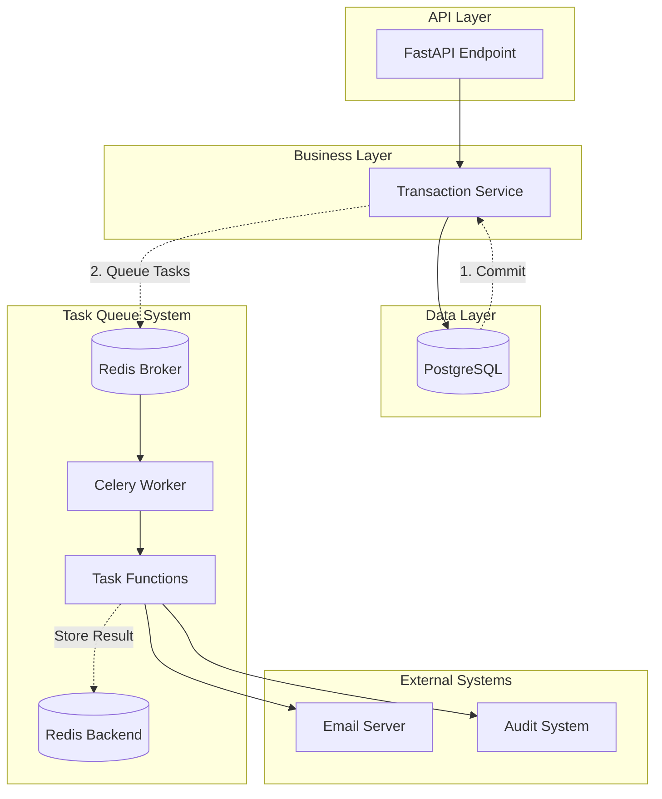
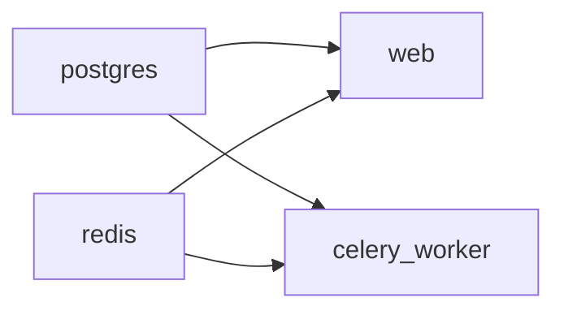

# Design Document

## Overview

This design document specifies the integration of Celery-based asynchronous task processing into the High-Frequency Transaction System. The enhancement offloads slow I/O operations (email notifications and audit logging) to background workers, enabling immediate API responses while ensuring reliable background processing.

The system uses Celery 5.x with Redis as both the message broker and result backend. Tasks are queued only after database transactions commit successfully, preventing background tasks from referencing uncommitted or rolled-back data.

## Architecture



### Execution Flow

1. **API Request**: Client initiates fund transfer
2. **Database Transaction**: Service executes transfer with ACID guarantees
3. **Commit**: Transaction commits successfully, session closes
4. **Task Queuing**: API layer queues email and audit tasks (`.delay()`)
5. **Immediate Response**: API returns transaction result to client
6. **Background Processing**: Celery worker consumes tasks from queue
7. **Task Execution**: Worker sends email and writes audit log
8. **Result Storage**: Task results stored in Redis backend

### Critical Design Decision: Task Queuing After Commit

**Problem**: If tasks are queued inside the database transaction block and the transaction rolls back, background tasks might send "Success" emails for failed transfers.

**Solution**: Queue tasks AFTER the transaction commits and the session closes:

```python
# WRONG - Tasks queued inside transaction
async with session.begin():
    transaction = await service.transfer_funds(...)
    send_email.delay(...)  # ❌ Queued before commit!
    
# RIGHT - Tasks queued after commit
async with session.begin():
    transaction = await service.transfer_funds(...)
    await session.refresh(transaction)
# Transaction committed here, session closed

# Now safe to queue tasks
send_email.delay(...)  # ✅ Queued after commit!
audit_log.delay(...)
```

## Components and Interfaces

### Directory Structure

```
project-root/
├── app/
│   ├── core/
│   │   ├── config.py           # Updated with Celery settings
│   │   └── celery_app.py       # NEW: Celery instance
│   ├── worker.py               # NEW: Task definitions
│   └── api/
│       └── v1/
│           └── transactions.py # Updated with task queuing
├── docker-compose.yml          # Updated with celery_worker service
└── requirements.txt            # Updated with celery[redis]
```

### Celery Application Configuration

```python
# app/core/celery_app.py
from celery import Celery
from app.core.config import get_settings

settings = get_settings()

# Create Celery instance
celery_app = Celery(
    "hfts_worker",
    broker=settings.CELERY_BROKER_URL,
    backend=settings.CELERY_RESULT_BACKEND,
)

# Configure Celery
celery_app.conf.update(
    task_serializer="json",
    result_serializer="json",
    accept_content=["json"],
    timezone="UTC",
    enable_utc=True,
    task_track_started=True,
    task_time_limit=300,  # 5 minutes max per task
    result_expires=3600,  # Results expire after 1 hour
)
```

### Configuration Settings Update

```python
# app/core/config.py (additions)
class Settings(BaseSettings):
    # ... existing fields ...
    
    # Celery - Optional with defaults
    CELERY_BROKER_URL: str = "redis://localhost:6379/0"
    CELERY_RESULT_BACKEND: str = "redis://localhost:6379/0"
    
    @property
    def celery_broker_url(self) -> str:
        """Construct Celery broker URL using Redis settings."""
        return f"redis://{self.REDIS_HOST}:{self.REDIS_PORT}/0"
    
    @property
    def celery_result_backend(self) -> str:
        """Construct Celery result backend URL using Redis settings."""
        return f"redis://{self.REDIS_HOST}:{self.REDIS_PORT}/0"
```

### Task Definitions

```python
# app/worker.py
import time
from celery import Task
from app.core.celery_app import celery_app

@celery_app.task(name="send_transaction_email", bind=True)
def send_transaction_email(
    self: Task,
    email: str,
    amount: str,
    status: str
) -> dict:
    """
    Send email notification about transaction.
    
    Simulates slow SMTP server with configurable delay.
    In production, this would use an email service like SendGrid or AWS SES.
    
    Args:
        email: Recipient email address
        amount: Transaction amount as string (e.g., "100.5000")
        status: Transaction status ("SUCCESS" or "FAILED")
        
    Returns:
        dict: Result with success status and message
    """
    # Simulate slow SMTP server (2 seconds)
    time.sleep(2)
    
    # Log the email (in production, actually send email)
    message = f"Sending email to {email}: Transfer {amount} {status}"
    print(f"[EMAIL TASK {self.request.id}] {message}")
    
    return {
        "success": True,
        "message": message,
        "task_id": self.request.id
    }


@celery_app.task(name="audit_log_transaction", bind=True)
def audit_log_transaction(
    self: Task,
    transaction_id: str,
    data: dict
) -> dict:
    """
    Write transaction to audit log system.
    
    Simulates writing to external audit system with configurable delay.
    In production, this would write to a separate audit database or service.
    
    Args:
        transaction_id: UUID of the transaction
        data: Transaction data dictionary with keys:
            - sender_wallet_id: UUID string
            - receiver_wallet_id: UUID string
            - amount: Decimal string
            - status: Status string
            - created_at: ISO timestamp string
            
    Returns:
        dict: Result with success status and message
    """
    # Simulate slow audit system write (1 second)
    time.sleep(1)
    
    # Log the audit entry (in production, write to audit system)
    message = f"Audit log for transaction {transaction_id}: {data}"
    print(f"[AUDIT TASK {self.request.id}] {message}")
    
    return {
        "success": True,
        "message": message,
        "task_id": self.request.id,
        "transaction_id": transaction_id
    }
```

### API Integration

```python
# app/api/v1/transactions.py (updated)
from app.worker import send_transaction_email, audit_log_transaction

@router.post("/transfer", response_model=TransactionRead, status_code=200)
async def transfer_funds(
    request: TransferRequest,
    session: AsyncSession = Depends(get_async_session),
):
    """Transfer funds between two wallets with async notifications."""
    service = TransactionService()

    try:
        # Begin atomic transaction
        async with session.begin():
            transaction = await service.transfer_funds(
                session=session,
                sender_wallet_id=request.sender_wallet_id,
                receiver_wallet_id=request.receiver_wallet_id,
                amount=request.amount,
            )
            await session.refresh(transaction)
        
        # ✅ CRITICAL: Transaction committed and session closed
        # Now safe to queue background tasks
        
        # Queue email notification task
        send_transaction_email.delay(
            email="user@example.com",  # In production: fetch from user record
            amount=str(transaction.amount),
            status="SUCCESS"
        )
        
        # Queue audit log task
        audit_log_transaction.delay(
            transaction_id=str(transaction.id),
            data={
                "sender_wallet_id": str(transaction.sender_wallet_id),
                "receiver_wallet_id": str(transaction.receiver_wallet_id),
                "amount": str(transaction.amount),
                "status": transaction.status.value,
                "created_at": transaction.created_at.isoformat()
            }
        )
        
        # Return immediately - tasks execute in background
        return transaction

    except NotFoundError as e:
        # Transaction rolled back - no tasks queued
        raise HTTPException(status_code=404, detail=e.message)
    except ValidationError as e:
        raise HTTPException(status_code=400, detail=e.message)
    except InsufficientFundsError as e:
        raise HTTPException(status_code=400, detail=e.message)
    except Exception as e:
        raise HTTPException(status_code=500, detail=f"Internal server error: {str(e)}")
```

## Data Models

No new database models are required. Tasks operate on serialized data extracted from existing models:

### Task Parameter Schemas

**Email Task Parameters:**
- `email`: string (email address)
- `amount`: string (decimal formatted as string, e.g., "100.5000")
- `status`: string ("SUCCESS" or "FAILED")

**Audit Task Parameters:**
- `transaction_id`: string (UUID formatted as string)
- `data`: dictionary containing:
  - `sender_wallet_id`: string (UUID)
  - `receiver_wallet_id`: string (UUID)
  - `amount`: string (decimal)
  - `status`: string (enum value)
  - `created_at`: string (ISO 8601 timestamp)

### Task Result Schema

Both tasks return a dictionary:
```python
{
    "success": bool,
    "message": str,
    "task_id": str
}
```

## Correctness Properties

*A property is a characteristic or behavior that should hold true across all valid executions of a system-essentially, a formal statement about what the system should do. Properties serve as the bridge between human-readable specifications and machine-verifiable correctness guarantees.*

### Acceptance Criteria Testing Prework

1.1 WHEN the Celery application is initialized THEN the System SHALL create a Celery instance with a unique application name
  Thoughts: This is testing that initialization produces a specific object type with a specific attribute value. We can test this by initializing and checking the instance.
  Testable: yes - example

1.2 WHEN the Celery application loads configuration THEN the System SHALL use Redis as the broker URL from environment variables
  Thoughts: This is testing that configuration loading correctly reads from environment and sets the broker URL. We can test this across different environment variable values.
  Testable: yes - property

1.3 WHEN the Celery application loads configuration THEN the System SHALL use Redis as the result backend URL from environment variables
  Thoughts: Similar to 1.2, testing configuration loading for backend URL across different values.
  Testable: yes - property

1.4 WHEN the Celery application is configured THEN the System SHALL set task serialization format to JSON
  Thoughts: This is testing a specific configuration value. Single check.
  Testable: yes - example

1.5 WHEN the Celery application is configured THEN the System SHALL set result serialization format to JSON
  Thoughts: This is testing a specific configuration value. Single check.
  Testable: yes - example

1.6 WHEN the Celery application is configured THEN the System SHALL accept content types including JSON
  Thoughts: This is testing a specific configuration value. Single check.
  Testable: yes - example

2.1 WHEN the email notification task is defined THEN the System SHALL accept email address, amount, and status as string parameters
  Thoughts: This is testing the task signature. We can verify the task accepts these parameters by calling it.
  Testable: yes - example

2.2 WHEN the email notification task executes THEN the System SHALL simulate SMTP server delay using a configurable sleep duration
  Thoughts: This is testing that execution takes at least a certain amount of time. We can measure execution time.
  Testable: yes - example

2.3 WHEN the email notification task executes THEN the System SHALL log a message containing the recipient email, transfer amount, and transaction status
  Thoughts: This is testing that for any input parameters, the log output contains those parameters. We can test this across random inputs.
  Testable: yes - property

2.4 WHEN the email notification task completes THEN the System SHALL return a success indicator
  Thoughts: This is testing that for any valid input, the task returns a success indicator. We can test across random inputs.
  Testable: yes - property

2.5 WHEN the email notification task is invoked asynchronously THEN the System SHALL queue the task without blocking the caller
  Thoughts: This is testing that .delay() returns immediately without waiting for task completion. We can measure the time .delay() takes.
  Testable: yes - example

3.1 WHEN the audit log task is defined THEN the System SHALL accept transaction ID and transaction data dictionary as parameters
  Thoughts: This is testing the task signature. Single check.
  Testable: yes - example

3.2 WHEN the audit log task executes THEN the System SHALL simulate writing to an external audit system using a configurable sleep duration
  Thoughts: This is testing execution time. Single check.
  Testable: yes - example

3.3 WHEN the audit log task executes THEN the System SHALL log a message containing the transaction ID and data
  Thoughts: This is testing that for any input, the log contains that input. We can test across random inputs.
  Testable: yes - property

3.4 WHEN the audit log task completes THEN the System SHALL return a success indicator
  Thoughts: This is testing that for any valid input, the task returns success. We can test across random inputs.
  Testable: yes - property

3.5 WHEN the audit log task is invoked asynchronously THEN the System SHALL queue the task without blocking the caller
  Thoughts: This is testing .delay() returns immediately. Single check.
  Testable: yes - example

4.1 WHEN a fund transfer API request is processed THEN the System SHALL commit the database transaction before queuing any background tasks
  Thoughts: This is a critical ordering requirement. We need to verify that in the code flow, commit happens before .delay() calls. This is more of a code structure test than a runtime property.
  Testable: no

4.2 WHEN a fund transfer API request is processed THEN the System SHALL close the database session before queuing any background tasks
  Thoughts: Similar to 4.1, this is about code structure and ordering. We can verify session is closed before tasks are queued.
  Testable: no

4.3 WHEN a fund transfer completes successfully THEN the System SHALL queue an email notification task with the user email, transfer amount, and "SUCCESS" status
  Thoughts: This is testing that successful transfers result in a queued task. We can test this by mocking the task and verifying it was called.
  Testable: yes - example

4.4 WHEN a fund transfer completes successfully THEN the System SHALL queue an audit log task with the transaction ID and transaction data
  Thoughts: Similar to 4.3, testing that successful transfers queue audit tasks.
  Testable: yes - example

4.5 WHEN background tasks are queued THEN the System SHALL use the `.delay()` method to invoke tasks asynchronously
  Thoughts: This is testing implementation details - that we use .delay() specifically. Code inspection.
  Testable: no

4.6 WHEN background tasks are queued THEN the System SHALL not wait for task completion before returning the API response
  Thoughts: This is testing that the API response time is not affected by task execution time. We can measure API response time and verify it's much less than task execution time.
  Testable: yes - example

4.7 WHEN a fund transfer fails THEN the System SHALL not queue any background tasks
  Thoughts: This is testing that failed transfers don't queue tasks. We can test by triggering failures and verifying no tasks were queued.
  Testable: yes - example

5.1 WHEN the Celery worker is started THEN the System SHALL load the Celery application instance from the configured module path
  Thoughts: This is testing worker startup behavior. Integration test.
  Testable: no

5.2 WHEN the Celery worker is started THEN the System SHALL set log level to INFO for operational visibility
  Thoughts: This is testing configuration. Single check.
  Testable: no

5.3 WHEN the Celery worker is running THEN the System SHALL consume tasks from the Redis broker queue
  Thoughts: This is testing worker behavior. Integration test.
  Testable: no

5.4 WHEN the Celery worker receives a task THEN the System SHALL execute the task function with the provided parameters
  Thoughts: This is testing that for any task parameters, the worker executes the task with those parameters. We can test this across random inputs.
  Testable: yes - property

5.5 WHEN the Celery worker completes a task THEN the System SHALL store the result in the Redis backend
  Thoughts: This is testing that for any completed task, the result is stored. We can test across random tasks.
  Testable: yes - property

6.1-6.7: Docker Compose requirements
  Thoughts: These are infrastructure configuration requirements, not runtime properties.
  Testable: no

7.1-7.4: Configuration management
  Thoughts: These are about configuration structure, covered by other properties.
  Testable: no

8.1 WHEN a fund transfer transaction begins THEN the System SHALL not queue any tasks until the transaction commits
  Thoughts: This is about execution ordering. Covered by 4.1.
  Testable: no

8.2 WHEN a fund transfer transaction commits successfully THEN the System SHALL queue email and audit tasks immediately after commit
  Thoughts: This is about execution ordering and is covered by 4.3 and 4.4.
  Testable: no

8.3 WHEN a fund transfer transaction rolls back THEN the System SHALL not queue any tasks
  Thoughts: This is covered by 4.7.
  Testable: no

8.4 WHEN tasks are queued THEN the System SHALL pass only serializable data (strings, dictionaries) as task parameters
  Thoughts: This is testing that for any task invocation, parameters are JSON-serializable. We can test across random inputs.
  Testable: yes - property

8.5 WHEN tasks are queued THEN the System SHALL not pass database session objects or ORM model instances as parameters
  Thoughts: This is testing that parameters don't contain non-serializable objects. We can verify parameter types.
  Testable: yes - property

### Property Reflection

After reviewing all testable properties, I've identified the following consolidations:

- Properties 2.3 and 3.3 (log message contains input) can be combined into a single property about task logging
- Properties 2.4 and 3.4 (task returns success) can be combined into a single property about task return values
- Properties 5.4 and 5.5 are integration-level properties that are better tested through integration tests
- Properties 8.4 and 8.5 can be combined into a single property about parameter serializability

### Property 1: Celery Configuration from Environment

*For any* valid Redis host and port combination in environment variables, the Celery application SHALL construct broker and backend URLs using those values.

**Validates: Requirements 1.2, 1.3, 7.3, 7.4**

### Property 2: Task Logging Contains Input Parameters

*For any* task invocation with input parameters, the logged message SHALL contain all input parameter values.

**Validates: Requirements 2.3, 3.3**

### Property 3: Task Success Return Value

*For any* successful task execution, the task SHALL return a dictionary containing a success indicator set to True.

**Validates: Requirements 2.4, 3.4**

### Property 4: Task Parameter Serializability

*For any* task invocation, all task parameters SHALL be JSON-serializable (strings, numbers, dictionaries, lists) and SHALL NOT include database session objects or ORM model instances.

**Validates: Requirements 8.4, 8.5**

### Property 5: API Response Time Independence

*For any* successful fund transfer, the API response time SHALL be significantly less than the sum of task execution times, demonstrating that tasks execute asynchronously.

**Validates: Requirements 4.6**

## Error Handling

### Task Failure Handling

Celery provides automatic retry mechanisms for failed tasks:

```python
@celery_app.task(
    name="send_transaction_email",
    bind=True,
    autoretry_for=(Exception,),
    retry_kwargs={'max_retries': 3, 'countdown': 60},
    retry_backoff=True
)
def send_transaction_email(self: Task, email: str, amount: str, status: str):
    # Task implementation
    pass
```

**Retry Strategy:**
- Maximum 3 retries
- 60-second delay between retries
- Exponential backoff enabled
- After max retries, task marked as FAILED

### Task Monitoring

Tasks can be monitored using:
- Celery Flower (web-based monitoring tool)
- Redis CLI to inspect queue depth
- Application logs for task execution

### Dead Letter Queue

Failed tasks after max retries should be:
1. Logged with full error details
2. Stored in a dead letter queue for manual review
3. Trigger alerts for operations team

## Testing Strategy

### Testing Framework

- **Unit Testing**: pytest with pytest-asyncio
- **Property-Based Testing**: Hypothesis library
- **Integration Testing**: pytest with Docker Compose test environment
- **Mocking**: unittest.mock for Celery task mocking

### Unit Testing Approach

Unit tests will cover:
- Celery application initialization
- Configuration loading
- Task function execution (synchronous calls)
- API endpoint with mocked tasks
- Task parameter serialization

### Property-Based Testing Approach

Property-based tests will use Hypothesis with minimum 100 iterations:

```python
from hypothesis import given, strategies as st

# Strategy for email addresses
email_strategy = st.emails()

# Strategy for decimal amounts as strings
amount_strategy = st.decimals(
    min_value=Decimal("0.0001"),
    max_value=Decimal("999999.9999"),
    places=4
).map(str)

# Strategy for transaction status
status_strategy = st.sampled_from(["SUCCESS", "FAILED"])

# Strategy for transaction data
transaction_data_strategy = st.fixed_dictionaries({
    "sender_wallet_id": st.uuids().map(str),
    "receiver_wallet_id": st.uuids().map(str),
    "amount": amount_strategy,
    "status": st.sampled_from(["PENDING", "COMPLETED", "FAILED"]),
    "created_at": st.datetimes().map(lambda dt: dt.isoformat())
})
```

### Integration Testing Approach

Integration tests will:
- Start Redis container
- Start Celery worker
- Execute API requests
- Verify tasks are queued and executed
- Verify task results in Redis backend

### Test File Organization

```
tests/
├── unit/
│   ├── test_celery_config.py       # Celery initialization tests
│   ├── test_tasks.py                # Task function unit tests
│   └── test_api_with_tasks.py      # API with mocked tasks
├── properties/
│   ├── test_celery_config_property.py      # Property 1
│   ├── test_task_logging_property.py       # Property 2
│   ├── test_task_return_property.py        # Property 3
│   ├── test_task_serialization_property.py # Property 4
│   └── test_api_response_time_property.py  # Property 5
└── integration/
    └── test_celery_integration.py   # End-to-end task execution
```

### Property Test Requirements

1. Each property MUST be implemented by a SINGLE property-based test
2. Each test MUST be tagged with: `**Feature: async-task-processing, Property {number}: {property_text}**`
3. Each test MUST run minimum 100 iterations
4. Tests SHOULD NOT use mocks for core logic validation (except for external systems like SMTP)

## Docker Compose Integration

### Updated docker-compose.yml

```yaml
version: '3.8'

services:
  postgres:
    # ... existing configuration ...

  redis:
    # ... existing configuration ...

  web:
    build: .
    container_name: hfts_web
    command: uvicorn app.main:app --host 0.0.0.0 --port 8000 --reload
    ports:
      - "8000:8000"
    volumes:
      - .:/app
    env_file:
      - .env
    depends_on:
      postgres:
        condition: service_healthy
      redis:
        condition: service_healthy
    environment:
      - POSTGRES_HOST=postgres
      - REDIS_HOST=redis

  celery_worker:
    build: .
    container_name: hfts_celery_worker
    command: celery -A app.core.celery_app worker --loglevel=info
    volumes:
      - .:/app
    env_file:
      - .env
    depends_on:
      postgres:
        condition: service_healthy
      redis:
        condition: service_healthy
    environment:
      - POSTGRES_HOST=postgres
      - REDIS_HOST=redis
    restart: unless-stopped

  pgadmin:
    # ... existing configuration ...

volumes:
  postgres_data:
  redis_data:
  pgadmin_data:
```

### Service Dependencies



## Performance Considerations

### Task Queue Sizing

- **Queue Depth Monitoring**: Alert when queue depth exceeds 1000 tasks
- **Worker Scaling**: Add workers when queue depth consistently high
- **Task Timeout**: 5-minute maximum per task to prevent hung workers

### Redis Memory Management

- **Result Expiration**: Task results expire after 1 hour
- **Memory Limit**: Configure Redis maxmemory policy (allkeys-lru)
- **Persistence**: Enable RDB snapshots for task queue durability

### API Response Time

Expected response times:
- **Without Celery**: 3+ seconds (email 2s + audit 1s + transfer)
- **With Celery**: <100ms (transfer only, tasks queued)
- **Improvement**: 30x faster API responses

## Security Considerations

### Task Parameter Validation

- Never pass sensitive data (passwords, tokens) in task parameters
- Validate all task inputs before execution
- Use task parameter encryption for sensitive data if required

### Redis Security

- Enable Redis authentication (requirepass)
- Use TLS for Redis connections in production
- Restrict Redis network access to application servers only

### Task Authorization

- Tasks should not perform privileged operations without validation
- Implement task-level authorization checks
- Log all task executions for audit trail

## Deployment Considerations

### Environment Variables

Required environment variables:
```bash
# Existing
POSTGRES_HOST=postgres
POSTGRES_PORT=5432
POSTGRES_USER=hfts_user
POSTGRES_PASSWORD=secure_password
POSTGRES_DB=hfts_db
REDIS_HOST=redis
REDIS_PORT=6379

# New for Celery
CELERY_BROKER_URL=redis://redis:6379/0
CELERY_RESULT_BACKEND=redis://redis:6379/0
```

### Production Recommendations

1. **Worker Scaling**: Run multiple worker instances for high availability
2. **Monitoring**: Deploy Celery Flower for task monitoring
3. **Logging**: Centralize logs using ELK stack or CloudWatch
4. **Alerting**: Alert on task failure rates, queue depth, worker health
5. **Graceful Shutdown**: Configure worker graceful shutdown timeout

### Health Checks

```python
# Add health check endpoint for worker status
@router.get("/health/celery")
async def celery_health():
    """Check Celery worker connectivity."""
    try:
        # Ping Celery workers
        result = celery_app.control.inspect().ping()
        if result:
            return {"status": "healthy", "workers": len(result)}
        return {"status": "unhealthy", "workers": 0}
    except Exception as e:
        return {"status": "error", "message": str(e)}
```
