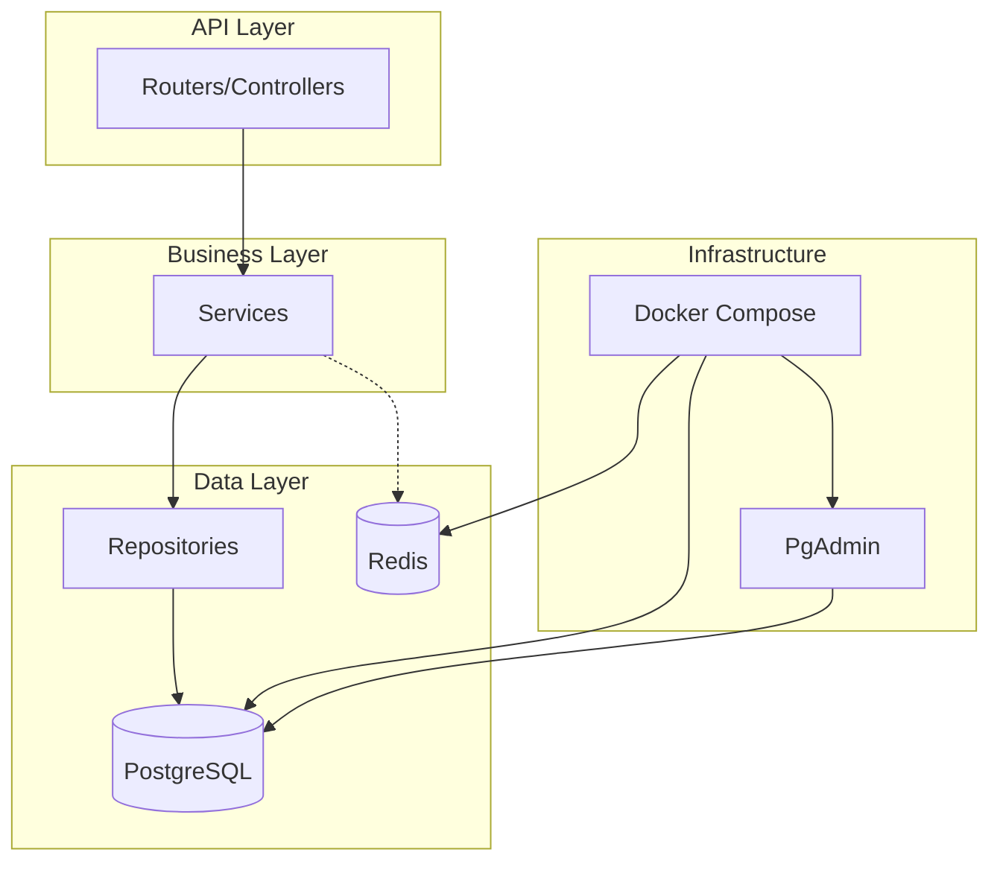
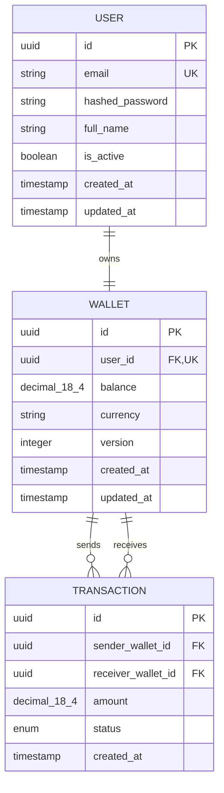

# Design Document

## Overview

The High-Frequency Transaction System (Core Banking Lite) is a fintech portfolio project demonstrating professional-grade architecture for handling financial transactions. Built with Python 3.12+, FastAPI (async), PostgreSQL, and SQLAlchemy (async), the system provides user management, wallet operations, and an immutable transaction ledger with financial-grade precision.

The architecture follows the Service-Repository Pattern with clear separation of concerns, enabling scalability, testability, and maintainability.

## Architecture



### Layer Responsibilities

1. **API Layer (`app/api`)**: HTTP request handling, input validation, response formatting
2. **Service Layer (`app/services`)**: Business logic, transaction orchestration, validation rules
3. **Repository Layer (`app/repositories`)**: Data access abstraction, query building
4. **Data Layer (`app/db`, `app/models`)**: ORM models, database connection, migrations

## Components and Interfaces

### Directory Structure

```
project-root/
├── app/
│   ├── __init__.py
│   ├── main.py                 # FastAPI application entry point
│   ├── api/
│   │   ├── __init__.py
│   │   ├── deps.py             # Dependency injection
│   │   └── v1/
│   │       ├── __init__.py
│   │       ├── router.py       # API version router
│   │       ├── users.py        # User endpoints
│   │       ├── wallets.py      # Wallet endpoints
│   │       └── transactions.py # Transaction endpoints
│   ├── core/
│   │   ├── __init__.py
│   │   ├── config.py           # Pydantic settings
│   │   ├── security.py         # Password hashing, JWT
│   │   └── exceptions.py       # Custom exceptions
│   ├── db/
│   │   ├── __init__.py
│   │   ├── base.py             # Declarative base
│   │   └── session.py          # Async session management
│   ├── models/
│   │   ├── __init__.py
│   │   ├── user.py             # User ORM model
│   │   ├── wallet.py           # Wallet ORM model
│   │   └── transaction.py      # Transaction ORM model
│   ├── schemas/
│   │   ├── __init__.py
│   │   ├── user.py             # User Pydantic schemas
│   │   ├── wallet.py           # Wallet Pydantic schemas
│   │   └── transaction.py      # Transaction Pydantic schemas
│   └── services/
│       ├── __init__.py
│       ├── user_service.py
│       ├── wallet_service.py
│       └── transaction_service.py
├── alembic/
│   ├── env.py
│   └── versions/
├── tests/
│   ├── __init__.py
│   ├── conftest.py
│   └── ...
├── docker-compose.yml
├── Dockerfile
├── .env.example
├── .env
├── alembic.ini
├── pyproject.toml
└── requirements.txt
```

### Core Configuration Interface

```python
# app/core/config.py
class Settings(BaseSettings):
    # Database
    POSTGRES_HOST: str
    POSTGRES_PORT: int = 5432
    POSTGRES_USER: str
    POSTGRES_PASSWORD: str
    POSTGRES_DB: str
    
    # Redis
    REDIS_HOST: str = "localhost"
    REDIS_PORT: int = 6379
    
    # Application
    SECRET_KEY: str
    DEBUG: bool = False
    
    @property
    def database_url(self) -> str:
        return f"postgresql+asyncpg://{self.POSTGRES_USER}:{self.POSTGRES_PASSWORD}@{self.POSTGRES_HOST}:{self.POSTGRES_PORT}/{self.POSTGRES_DB}"
```

### Database Session Interface

```python
# app/db/session.py
async def get_async_session() -> AsyncGenerator[AsyncSession, None]:
    async with async_session_maker() as session:
        try:
            yield session
        finally:
            await session.close()
```

## Data Models

### Entity Relationship Diagram



### User Model

| Field | Type | Constraints | Description |
|-------|------|-------------|-------------|
| id | UUID | PK, default=uuid4 | Unique identifier |
| email | String(255) | UNIQUE, NOT NULL, INDEX | User email address |
| hashed_password | String(255) | NOT NULL | Bcrypt hashed password |
| full_name | String(255) | NOT NULL | User's display name |
| is_active | Boolean | NOT NULL, default=True | Account status |
| created_at | DateTime | NOT NULL, default=now | Record creation time |
| updated_at | DateTime | NOT NULL, onupdate=now | Last modification time |

### Wallet Model

| Field | Type | Constraints | Description |
|-------|------|-------------|-------------|
| id | UUID | PK, default=uuid4 | Unique identifier |
| user_id | UUID | FK(users.id), UNIQUE, NOT NULL | Owner reference |
| balance | DECIMAL(18,4) | NOT NULL, default=0.0000 | Current balance |
| currency | String(3) | NOT NULL, default="USD" | ISO currency code |
| version | Integer | NOT NULL, default=1 | Optimistic lock version |
| created_at | DateTime | NOT NULL, default=now | Record creation time |
| updated_at | DateTime | NOT NULL, onupdate=now | Last modification time |

### Transaction Model

| Field | Type | Constraints | Description |
|-------|------|-------------|-------------|
| id | UUID | PK, default=uuid4 | Unique identifier |
| sender_wallet_id | UUID | FK(wallets.id), NOT NULL, INDEX | Source wallet |
| receiver_wallet_id | UUID | FK(wallets.id), NOT NULL, INDEX | Destination wallet |
| amount | DECIMAL(18,4) | NOT NULL | Transfer amount |
| status | Enum | NOT NULL, default=PENDING | Transaction state |
| created_at | DateTime | NOT NULL, default=now | Transaction timestamp |

### Transaction Status Enum

```python
class TransactionStatus(str, Enum):
    PENDING = "PENDING"
    COMPLETED = "COMPLETED"
    FAILED = "FAILED"
```

## Correctness Properties

*A property is a characteristic or behavior that should hold true across all valid executions of a system-essentially, a formal statement about what the system should do. Properties serve as the bridge between human-readable specifications and machine-verifiable correctness guarantees.*


Based on the prework analysis, the following properties have been identified and consolidated to eliminate redundancy:

### Property 1: User Schema Round-Trip

*For any* valid User object, serializing to JSON (via Pydantic schema) and deserializing back SHALL produce an equivalent User object with all non-sensitive fields preserved.

**Validates: Requirements 4.4, 4.5**

### Property 2: Wallet Schema Round-Trip with Decimal Precision

*For any* valid Wallet object with balance having up to 4 decimal places, serializing to JSON and deserializing back SHALL produce an equivalent Wallet object with exact decimal precision preserved.

**Validates: Requirements 5.6, 5.7**

### Property 3: Transaction Schema Round-Trip

*For any* valid Transaction object, serializing to JSON and deserializing back SHALL produce an equivalent Transaction object with exact decimal amount precision and valid enum status preserved.

**Validates: Requirements 6.8, 6.9**

### Property 4: Configuration Validation

*For any* set of environment variables missing a required database parameter (POSTGRES_HOST, POSTGRES_USER, POSTGRES_PASSWORD, POSTGRES_DB), loading the Settings SHALL raise a ValidationError.

**Validates: Requirements 3.1, 3.2**

### Property 5: User Email Uniqueness

*For any* two User creation attempts with identical email addresses, the second attempt SHALL raise an IntegrityError.

**Validates: Requirements 4.2**

### Property 6: Wallet-User One-to-One Constraint

*For any* User that already has a Wallet, attempting to create a second Wallet for that User SHALL raise an IntegrityError.

**Validates: Requirements 5.1**

### Property 7: Transaction Foreign Key Integrity

*For any* Transaction creation with a sender_wallet_id or receiver_wallet_id that does not exist in the Wallets table, the creation SHALL raise an IntegrityError.

**Validates: Requirements 6.2, 6.3**

### Property 8: Financial Decimal Precision

*For any* decimal value with up to 4 decimal places stored in Wallet.balance or Transaction.amount, retrieval SHALL return the exact same decimal value without floating-point errors.

**Validates: Requirements 5.2, 6.4**

### Property 9: Transaction ID Uniqueness

*For any* set of N transactions created, all N transaction IDs SHALL be unique.

**Validates: Requirements 6.1**

### Property 10: Transfer Balance Conservation

*For any* successful fund transfer between two wallets, the sum of both wallet balances after the transfer SHALL equal the sum of both wallet balances before the transfer.

**Validates: Requirements 8.7, 8.8**

### Property 11: Transfer Atomicity on Failure

*For any* fund transfer that fails validation (non-existent wallet, insufficient funds, invalid amount, self-transfer), both wallet balances SHALL remain unchanged.

**Validates: Requirements 8.10**

### Property 12: Transfer Creates Completed Transaction

*For any* successful fund transfer, a Transaction record SHALL be created with status COMPLETED and the exact transfer amount.

**Validates: Requirements 8.9**

### Property 13: Pessimistic Locking Prevents Concurrent Modification

*For any* two concurrent transfer attempts involving the same wallet, when using pessimistic locking, the second transaction SHALL wait until the first completes, and both SHALL see consistent wallet balances.

**Validates: Requirements 10.1, 10.2**

### Property 14: Optimistic Locking Detects Concurrent Modification

*For any* wallet update using optimistic locking, if another transaction modifies the wallet between read and update, the System SHALL raise a ConcurrencyError.

**Validates: Requirements 10.3, 10.4, 10.5, 10.6**

## Concurrency Control Strategies

The system provides two concurrency control mechanisms for fund transfers, each optimized for different scenarios:

### Pessimistic Locking (Method 1: "The Safe Way")

**When to Use:**
- High contention scenarios where conflicts are frequent
- Critical operations where blocking is acceptable
- When consistency is more important than throughput
- Banking systems with frequent transfers between popular accounts

**How It Works:**
```python
# Lock rows immediately when reading
sender_result = await session.execute(
    select(Wallet).where(Wallet.id == sender_wallet_id).with_for_update()
)
```

**Characteristics:**
- Acquires exclusive row locks using `SELECT ... FOR UPDATE`
- Other transactions wait (block) until lock is released
- Guarantees no conflicts - first transaction wins, others wait
- Higher latency under contention but guaranteed success
- No retry logic needed

**Trade-offs:**
- ✅ Zero conflict errors - transactions always succeed if valid
- ✅ Simpler error handling - no retry logic required
- ✅ Predictable behavior under load
- ❌ Lower throughput under high contention
- ❌ Risk of deadlocks if locks acquired in different orders
- ❌ Blocked transactions consume database connections

### Optimistic Locking (Method 2: "The Fast Way")

**When to Use:**
- Low contention scenarios where conflicts are rare
- Read-heavy workloads with occasional updates
- When throughput is more important than latency
- Systems where retry logic is acceptable

**How It Works:**
```python
# Read without locking, remember version
sender_wallet = await get_wallet(sender_wallet_id)
current_version = sender_wallet.version

# Update with version check
result = await session.execute(
    update(Wallet)
    .where(Wallet.id == sender_wallet_id, Wallet.version == current_version)
    .values(balance=new_balance, version=current_version + 1)
)

# Check if update succeeded
if result.rowcount == 0:
    raise ConcurrencyError("Wallet was modified by another transaction")
```

**Characteristics:**
- No locks during read phase
- Version column detects concurrent modifications
- Failed transactions raise ConcurrencyError
- Requires retry logic in caller
- Higher throughput when conflicts are rare

**Trade-offs:**
- ✅ Higher throughput under low contention
- ✅ No blocking - transactions never wait
- ✅ No deadlock risk
- ✅ Better database connection utilization
- ❌ Conflicts result in errors requiring retry
- ❌ More complex error handling
- ❌ Wasted work when conflicts occur

### Decision Matrix

| Scenario | Recommended Strategy | Reason |
|----------|---------------------|---------|
| Popular merchant account receiving 1000s of payments | Pessimistic | High contention, blocking acceptable |
| Peer-to-peer transfers between random users | Optimistic | Low contention, maximize throughput |
| Payroll processing (batch transfers) | Pessimistic | Predictable, must succeed |
| Micro-transactions in gaming | Optimistic | High volume, retry acceptable |
| ATM withdrawals | Pessimistic | Must be reliable, low volume |

## Error Handling

### Exception Hierarchy

```python
# app/core/exceptions.py
class AppException(Exception):
    """Base application exception"""
    def __init__(self, message: str, status_code: int = 500):
        self.message = message
        self.status_code = status_code

class NotFoundError(AppException):
    """Resource not found"""
    def __init__(self, resource: str, identifier: str):
        super().__init__(f"{resource} with id {identifier} not found", 404)

class ConflictError(AppException):
    """Resource conflict (duplicate, version mismatch)"""
    def __init__(self, message: str):
        super().__init__(message, 409)

class ValidationError(AppException):
    """Input validation failed"""
    def __init__(self, message: str):
        super().__init__(message, 422)

class InsufficientFundsError(AppException):
    """Wallet balance insufficient for transaction"""
    def __init__(self, wallet_id: str, required: Decimal, available: Decimal):
        super().__init__(
            f"Insufficient funds in wallet {wallet_id}: required {required}, available {available}",
            400
        )

class ConcurrencyError(AppException):
    """Concurrent modification detected (optimistic locking)"""
    def __init__(self, resource: str, identifier: str):
        super().__init__(
            f"{resource} {identifier} was modified by another transaction. Please retry.",
            409
        )
```

### Error Response Format

```json
{
    "error": {
        "type": "InsufficientFundsError",
        "message": "Insufficient funds in wallet abc-123: required 100.0000, available 50.0000",
        "status_code": 400
    }
}
```

## Testing Strategy

### Testing Framework

- **Unit Testing**: pytest with pytest-asyncio for async test support
- **Property-Based Testing**: Hypothesis library for Python
- **Test Database**: SQLite in-memory or PostgreSQL test container

### Unit Testing Approach

Unit tests will cover:
- Specific examples demonstrating correct behavior
- Edge cases (empty inputs, boundary values)
- Error conditions and exception handling
- Integration points between layers

### Property-Based Testing Approach

Property-based tests will use the Hypothesis library with the following configuration:
- Minimum 100 iterations per property test
- Custom strategies for generating valid domain objects
- Each test tagged with format: `**Feature: high-frequency-transaction-system, Property {number}: {property_text}**`

#### Hypothesis Strategies

```python
from hypothesis import strategies as st
from decimal import Decimal

# Strategy for valid email addresses
email_strategy = st.emails()

# Strategy for DECIMAL(18,4) values
decimal_18_4_strategy = st.decimals(
    min_value=Decimal("0"),
    max_value=Decimal("99999999999999.9999"),
    places=4
)

# Strategy for valid User data
user_strategy = st.fixed_dictionaries({
    "email": email_strategy,
    "full_name": st.text(min_size=1, max_size=255),
    "password": st.text(min_size=8, max_size=128),
    "is_active": st.booleans()
})

# Strategy for valid Wallet data
wallet_strategy = st.fixed_dictionaries({
    "balance": decimal_18_4_strategy,
    "currency": st.sampled_from(["USD", "VND", "EUR"])
})

# Strategy for Transaction status
status_strategy = st.sampled_from(["PENDING", "COMPLETED", "FAILED"])
```

### Test File Organization

```
tests/
├── conftest.py              # Shared fixtures, database setup
├── unit/
│   ├── test_models.py       # ORM model unit tests
│   ├── test_schemas.py      # Pydantic schema unit tests
│   └── test_config.py       # Configuration unit tests
├── properties/
│   ├── test_schema_roundtrip.py    # Properties 1, 2, 3
│   ├── test_config_validation.py   # Property 4
│   ├── test_constraints.py         # Properties 5, 6, 7
│   └── test_decimal_precision.py   # Property 8
└── integration/
    └── test_database.py     # Database integration tests
```

### Property Test Requirements

1. Each correctness property MUST be implemented by a SINGLE property-based test
2. Each test MUST be tagged with: `**Feature: high-frequency-transaction-system, Property {number}: {property_text}**`
3. Each test MUST run minimum 100 iterations
4. Tests MUST NOT use mocks for core logic validation

## Service Layer Design

### Transaction Service Interface

The `TransactionService` provides business logic for fund transfers with ACID guarantees and multiple concurrency control strategies.

```python
# app/services/transaction_service.py
from decimal import Decimal
from uuid import UUID
from sqlalchemy.ext.asyncio import AsyncSession
from sqlalchemy import select, update
from app.models.wallet import Wallet
from app.models.transaction import Transaction, TransactionStatus
from app.core.exceptions import NotFoundError, ValidationError, InsufficientFundsError, ConcurrencyError

class TransactionService:
    """Service for handling fund transfer operations with multiple concurrency strategies"""
    
    async def transfer_funds(
        self,
        session: AsyncSession,
        sender_wallet_id: UUID,
        receiver_wallet_id: UUID,
        amount: Decimal
    ) -> Transaction:
        """
        Transfer funds using pessimistic locking (default method for backward compatibility).
        Delegates to transfer_funds_pessimistic.
        """
        return await self.transfer_funds_pessimistic(
            session, sender_wallet_id, receiver_wallet_id, amount
        )
    
    async def transfer_funds_pessimistic(
        self,
        session: AsyncSession,
        sender_wallet_id: UUID,
        receiver_wallet_id: UUID,
        amount: Decimal
    ) -> Transaction:
        """
        Transfer funds using PESSIMISTIC LOCKING (The "Safe" Way).
        
        This method acquires exclusive row locks on both wallets immediately,
        preventing any other transaction from reading or modifying them until
        this transaction commits or rolls back.
        
        **Concurrency Behavior:**
        - Uses SELECT ... FOR UPDATE to lock wallet rows
        - Other transactions attempting to access these wallets will BLOCK
        - Guarantees no concurrent modifications - zero conflict errors
        - First transaction to acquire locks wins, others wait in queue
        
        **When to Use:**
        - High contention scenarios (popular merchant accounts)
        - When consistency is more important than throughput
        - When blocking is acceptable
        - When retry logic should be avoided
        
        **Trade-offs:**
        - ✅ No conflicts - transactions always succeed if valid
        - ✅ Simpler error handling
        - ❌ Lower throughput under contention
        - ❌ Blocked transactions consume connections
        
        Args:
            session: Active async database session
            sender_wallet_id: UUID of the sending wallet
            receiver_wallet_id: UUID of the receiving wallet
            amount: Amount to transfer (DECIMAL 18,4)
            
        Returns:
            Transaction: The completed transaction record
            
        Raises:
            NotFoundError: If sender or receiver wallet doesn't exist
            ValidationError: If sender == receiver or amount <= 0
            InsufficientFundsError: If sender balance < amount
        """
        # Validation Step 1: Validate amount
        if amount <= Decimal("0"):
            raise ValidationError("Transfer amount must be greater than zero")
        
        # Validation Step 2: Check sender exists and LOCK ROW
        # with_for_update() acquires an exclusive lock on this row
        # Other transactions trying to read/update this wallet will WAIT here
        sender_result = await session.execute(
            select(Wallet).where(Wallet.id == sender_wallet_id).with_for_update()
        )
        sender_wallet = sender_result.scalar_one_or_none()
        if not sender_wallet:
            raise NotFoundError("Wallet", str(sender_wallet_id))
        
        # Validation Step 3: Check receiver exists and LOCK ROW
        # Now we hold locks on BOTH wallets - no one else can modify them
        receiver_result = await session.execute(
            select(Wallet).where(Wallet.id == receiver_wallet_id).with_for_update()
        )
        receiver_wallet = receiver_result.scalar_one_or_none()
        if not receiver_wallet:
            raise NotFoundError("Wallet", str(receiver_wallet_id))
        
        # Validation Step 4: Check self-transfer
        if sender_wallet_id == receiver_wallet_id:
            raise ValidationError("Cannot transfer funds to the same wallet")
        
        # Validation Step 5: Check sufficient funds
        if sender_wallet.balance < amount:
            raise InsufficientFundsError(
                str(sender_wallet_id),
                amount,
                sender_wallet.balance
            )
        
        # Execution Step 1: Deduct from sender
        # Safe to modify - we hold the lock, no one else can change this
        sender_wallet.balance -= amount
        
        # Execution Step 2: Add to receiver
        # Safe to modify - we hold the lock, no one else can change this
        receiver_wallet.balance += amount
        
        # Execution Step 3: Create transaction record
        transaction = Transaction(
            sender_wallet_id=sender_wallet_id,
            receiver_wallet_id=receiver_wallet_id,
            amount=amount,
            status=TransactionStatus.COMPLETED
        )
        session.add(transaction)
        
        # Locks are released when transaction commits or rolls back
        # Other waiting transactions can now proceed
        
        return transaction
    
    async def transfer_funds_optimistic(
        self,
        session: AsyncSession,
        sender_wallet_id: UUID,
        receiver_wallet_id: UUID,
        amount: Decimal
    ) -> Transaction:
        """
        Transfer funds using OPTIMISTIC LOCKING (The "Fast" Way).
        
        This method reads wallets WITHOUT locking, performs validations,
        then uses version numbers to detect if another transaction modified
        the wallets in the meantime.
        
        **Concurrency Behavior:**
        - Reads wallets without locks - other transactions can proceed
        - Uses version column to detect concurrent modifications
        - UPDATE with WHERE version = old_version
        - If rowcount == 0, someone else modified the wallet - raise error
        - Caller must implement retry logic
        
        **When to Use:**
        - Low contention scenarios (peer-to-peer transfers)
        - When throughput is more important than latency
        - When retry logic is acceptable
        - Read-heavy workloads
        
        **Trade-offs:**
        - ✅ Higher throughput under low contention
        - ✅ No blocking - better connection utilization
        - ✅ No deadlock risk
        - ❌ Conflicts result in errors requiring retry
        - ❌ Wasted work when conflicts occur
        
        Args:
            session: Active async database session
            sender_wallet_id: UUID of the sending wallet
            receiver_wallet_id: UUID of the receiving wallet
            amount: Amount to transfer (DECIMAL 18,4)
            
        Returns:
            Transaction: The completed transaction record
            
        Raises:
            NotFoundError: If sender or receiver wallet doesn't exist
            ValidationError: If sender == receiver or amount <= 0
            InsufficientFundsError: If sender balance < amount
            ConcurrencyError: If wallet was modified by another transaction
        """
        # Validation Step 1: Validate amount
        if amount <= Decimal("0"):
            raise ValidationError("Transfer amount must be greater than zero")
        
        # Validation Step 2: Read sender WITHOUT locking
        # Other transactions can read/modify this wallet concurrently
        sender_result = await session.execute(
            select(Wallet).where(Wallet.id == sender_wallet_id)
        )
        sender_wallet = sender_result.scalar_one_or_none()
        if not sender_wallet:
            raise NotFoundError("Wallet", str(sender_wallet_id))
        
        # Remember the version we read - this is our "snapshot"
        sender_version = sender_wallet.version
        sender_balance = sender_wallet.balance
        
        # Validation Step 3: Read receiver WITHOUT locking
        receiver_result = await session.execute(
            select(Wallet).where(Wallet.id == receiver_wallet_id)
        )
        receiver_wallet = receiver_result.scalar_one_or_none()
        if not receiver_wallet:
            raise NotFoundError("Wallet", str(receiver_wallet_id))
        
        # Remember the version we read
        receiver_version = receiver_wallet.version
        receiver_balance = receiver_wallet.balance
        
        # Validation Step 4: Check self-transfer
        if sender_wallet_id == receiver_wallet_id:
            raise ValidationError("Cannot transfer funds to the same wallet")
        
        # Validation Step 5: Check sufficient funds
        if sender_balance < amount:
            raise InsufficientFundsError(
                str(sender_wallet_id),
                amount,
                sender_balance
            )
        
        # Execution Step 1: Update sender with version check
        # This UPDATE will only succeed if version hasn't changed
        # If another transaction modified this wallet, version will be different
        sender_update_result = await session.execute(
            update(Wallet)
            .where(Wallet.id == sender_wallet_id, Wallet.version == sender_version)
            .values(
                balance=sender_balance - amount,
                version=sender_version + 1  # Increment version atomically
            )
        )
        
        # Check if update succeeded
        if sender_update_result.rowcount == 0:
            # Version mismatch - someone else modified this wallet
            raise ConcurrencyError("Wallet", str(sender_wallet_id))
        
        # Execution Step 2: Update receiver with version check
        receiver_update_result = await session.execute(
            update(Wallet)
            .where(Wallet.id == receiver_wallet_id, Wallet.version == receiver_version)
            .values(
                balance=receiver_balance + amount,
                version=receiver_version + 1  # Increment version atomically
            )
        )
        
        # Check if update succeeded
        if receiver_update_result.rowcount == 0:
            # Version mismatch - someone else modified this wallet
            # Sender update will be rolled back automatically
            raise ConcurrencyError("Wallet", str(receiver_wallet_id))
        
        # Execution Step 3: Create transaction record
        transaction = Transaction(
            sender_wallet_id=sender_wallet_id,
            receiver_wallet_id=receiver_wallet_id,
            amount=amount,
            status=TransactionStatus.COMPLETED
        )
        session.add(transaction)
        
        # If we reach here, both updates succeeded - versions matched
        # Transaction commits successfully
        
        return transaction
```

### Service Layer Patterns

1. **Dependency Injection**: Services receive database session as parameter
2. **Transaction Management**: Caller manages transaction boundaries using `async with session.begin()`
3. **Row Locking**: Use `with_for_update()` to prevent concurrent modification
4. **Validation First**: All validations before any state changes
5. **Atomic Operations**: All changes in single transaction

## API Layer Design

### Transfer Request Schema

```python
# app/schemas/transaction.py (additions)
from pydantic import BaseModel, Field
from decimal import Decimal
from uuid import UUID

class TransferRequest(BaseModel):
    """Request schema for fund transfer"""
    sender_wallet_id: UUID = Field(..., description="Source wallet UUID")
    receiver_wallet_id: UUID = Field(..., description="Destination wallet UUID")
    amount: Decimal = Field(..., gt=0, decimal_places=4, description="Transfer amount")
    
    class Config:
        json_schema_extra = {
            "example": {
                "sender_wallet_id": "123e4567-e89b-12d3-a456-426614174000",
                "receiver_wallet_id": "123e4567-e89b-12d3-a456-426614174001",
                "amount": "100.5000"
            }
        }
```

### Transaction Endpoint

```python
# app/api/v1/transactions.py
from fastapi import APIRouter, Depends, HTTPException
from sqlalchemy.ext.asyncio import AsyncSession
from app.api.deps import get_async_session
from app.services.transaction_service import TransactionService
from app.schemas.transaction import TransferRequest, TransactionRead
from app.core.exceptions import NotFoundError, ValidationError, InsufficientFundsError

router = APIRouter(prefix="/transactions", tags=["transactions"])

@router.post("/transfer", response_model=TransactionRead, status_code=200)
async def transfer_funds(
    request: TransferRequest,
    session: AsyncSession = Depends(get_async_session)
):
    """
    Transfer funds between two wallets.
    
    This endpoint provides ACID-compliant fund transfers with comprehensive validation.
    
    - **sender_wallet_id**: UUID of the wallet sending funds
    - **receiver_wallet_id**: UUID of the wallet receiving funds
    - **amount**: Amount to transfer (must be positive, max 4 decimal places)
    
    Returns the completed transaction record.
    """
    service = TransactionService()
    
    try:
        # Begin atomic transaction - commits on success, rolls back on exception
        async with session.begin():
            transaction = await service.transfer_funds(
                session=session,
                sender_wallet_id=request.sender_wallet_id,
                receiver_wallet_id=request.receiver_wallet_id,
                amount=request.amount
            )
            # Refresh to get auto-generated fields
            await session.refresh(transaction)
            
        # Transaction committed successfully at this point
        return transaction
        
    except NotFoundError as e:
        # Wallet not found - transaction rolled back
        raise HTTPException(status_code=404, detail=e.message)
    except ValidationError as e:
        # Invalid input - transaction rolled back
        raise HTTPException(status_code=400, detail=e.message)
    except InsufficientFundsError as e:
        # Insufficient funds - transaction rolled back
        raise HTTPException(status_code=400, detail=e.message)
    except Exception as e:
        # Unexpected error - transaction rolled back
        raise HTTPException(status_code=500, detail=f"Internal server error: {str(e)}")
```

### API Router Integration

```python
# app/api/v1/router.py
from fastapi import APIRouter
from app.api.v1 import transactions

api_router = APIRouter()
api_router.include_router(transactions.router)
```

### Error Response Examples

**404 Not Found:**
```json
{
    "detail": "Wallet with id 123e4567-e89b-12d3-a456-426614174000 not found"
}
```

**400 Bad Request (Insufficient Funds):**
```json
{
    "detail": "Insufficient funds in wallet 123e4567-e89b-12d3-a456-426614174000: required 100.0000, available 50.0000"
}
```

**400 Bad Request (Validation):**
```json
{
    "detail": "Transfer amount must be greater than zero"
}
```
